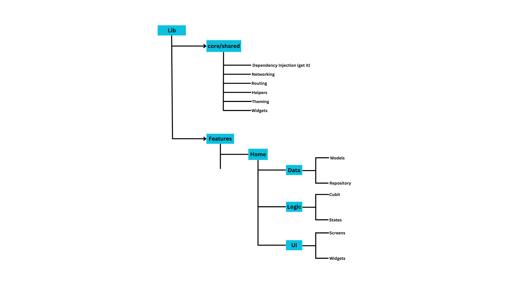

# To-Do App

This Flutter application is designed for managing to-do tasks. The app includes features such as authentication, a to-do list with various states, responsive design, and additional functionalities like QR code generation and scanning.

## Features
### Authentication:

- Users can sign in using their phone number and password.
- Phone number validation is implemented based on country codes.
- Authorization:

### JWT tokens are used for authorization.
- Handles token refresh with appropriate HTTP status codes:
- 401: Not authorized, requires token refresh.
- 403: Token refresh failed.
- 200: Token refresh successful.
  
### Task Management:
- Todo list includes loading, empty, and error states.
- Supports pull-to-refresh and infinite scrolling.
- Responsive design for all screen sizes.
- QR Code Generation:
- QR codes are generated for each task based on its ID.

### Image Attachment:
- Users can add images to tasks using the camera or gallery.

### QR Code Scanning:
- Allows scanning QR codes to open task details directly.

## Screenshots

            

## Project Structure

